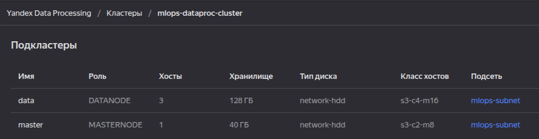

# Настройка облачной инфраструктуры для проекта по определению мошеннических транзакций


## Цель работы
Знакомство с облачным провайдером Yandex Cloud: 
  * работа с сервисами [Object Storage](#yandex-object-storage) и [Data Processing](#yandex-data-processing)
  * создание Spark-кластера и копирование в него данных 
  * изучение оценки затрат при проектировании облачной инфраструктуры


## Сервисы
### Yandex Object Storage
Универсальное масштабируемое S3-хранилище

### Yandex Data Processing
Сервис для обработки многотерабайтных массивов данных 
с использованием инструментов с открытым исходным кодом, 
таких как Apache Spark™, Apache Hadoop®, Apache HBase®, Apache Zeppelin™ 
и других сервисов экосистемы Apache®.


## Настройка источника, из которого будет устанавливаться провайдер
<details>
  <summary>файл настройки</summary>

  ```
  $ cat ~/.terraformrc 
  provider_installation {
    network_mirror {
      url = "https://terraform-mirror.yandexcloud.net/"
      include = ["registry.terraform.io/*/*"]
    }
    direct {
      exclude = ["registry.terraform.io/*/*"]
    }
  }
  ```
</details>


## Задачи:
1. Создан новый бакет в *Yandex Cloud Object Storage* с использованием *terraform* скрипта
	<details>
	  <summary>скрин бакета</summary>
	  
	  
	</details>

2. В него скопировано содержимое из предоставленного хранилища *S3*
	* развернут прокси-узел для работы с сервисами облака
	* скопированы данные из общего *S3-хранилища* в созданный бакет с использованием инструмента *s3cmd*
	* бакет доступен по ссылке: s3://mlops-bucket-fahzeeph/

	<br />
	<details>
	  <summary>содержимое бакета</summary>

	  ```
	  $ s3cmd ls s3://mlops-bucket-fahzeeph/
	  2025-05-20 07:51 2807409271   s3://mlops-bucket-fahzeeph/2019-08-22.txt
	  2025-05-20 07:52 2854479008   s3://mlops-bucket-fahzeeph/2019-09-21.txt
	  2025-05-20 07:53 2895460543   s3://mlops-bucket-fahzeeph/2019-10-21.txt
	  2025-05-20 07:54 2939120942   s3://mlops-bucket-fahzeeph/2019-11-20.txt
	  2025-05-20 07:56 2995462277   s3://mlops-bucket-fahzeeph/2019-12-20.txt
	  2025-05-20 07:57 2994906767   s3://mlops-bucket-fahzeeph/2020-01-19.txt
	  2025-05-20 07:58 2995431240   s3://mlops-bucket-fahzeeph/2020-02-18.txt
	  2025-05-20 07:59 2995176166   s3://mlops-bucket-fahzeeph/2020-03-19.txt
	  2025-05-20 08:00 2996034632   s3://mlops-bucket-fahzeeph/2020-04-18.txt
	  2025-05-20 08:02 2995666965   s3://mlops-bucket-fahzeeph/2020-05-18.txt
	  2025-05-20 08:03 2994699401   s3://mlops-bucket-fahzeeph/2020-06-17.txt
	  2025-05-20 08:05 2995810010   s3://mlops-bucket-fahzeeph/2020-07-17.txt
	  2025-05-20 08:06 2995995152   s3://mlops-bucket-fahzeeph/2020-08-16.txt
	  2025-05-20 08:08 2995778382   s3://mlops-bucket-fahzeeph/2020-09-15.txt
	  2025-05-20 08:09 2995868596   s3://mlops-bucket-fahzeeph/2020-10-15.txt
	  2025-05-20 08:11 2995467533   s3://mlops-bucket-fahzeeph/2020-11-14.txt
	  2025-05-20 08:12 2994761624   s3://mlops-bucket-fahzeeph/2020-12-14.txt
	  2025-05-20 08:13 2995390576   s3://mlops-bucket-fahzeeph/2021-01-13.txt
	  2025-05-20 08:15 2995780517   s3://mlops-bucket-fahzeeph/2021-02-12.txt
	  2025-05-20 08:16 2995191659   s3://mlops-bucket-fahzeeph/2021-03-14.txt
	  2025-05-20 08:17 2995446495   s3://mlops-bucket-fahzeeph/2021-04-13.txt
	  2025-05-20 08:19 3029170975   s3://mlops-bucket-fahzeeph/2021-05-13.txt
	  2025-05-20 08:20 3042691991   s3://mlops-bucket-fahzeeph/2021-06-12.txt
	  2025-05-20 08:21 3041980335   s3://mlops-bucket-fahzeeph/2021-07-12.txt
	  2025-05-20 08:22 3042662187   s3://mlops-bucket-fahzeeph/2021-08-11.txt
	  2025-05-20 08:24 3042455173   s3://mlops-bucket-fahzeeph/2021-09-10.txt
	  2025-05-20 08:25 3042424238   s3://mlops-bucket-fahzeeph/2021-10-10.txt
	  2025-05-20 08:26 3042358698   s3://mlops-bucket-fahzeeph/2021-11-09.txt
	  2025-05-20 08:27 3042923985   s3://mlops-bucket-fahzeeph/2021-12-09.txt
	  2025-05-20 08:28 3042868087   s3://mlops-bucket-fahzeeph/2022-01-08.txt
	  2025-05-20 08:29 3043148790   s3://mlops-bucket-fahzeeph/2022-02-07.txt
	  2025-05-20 08:31 3042312191   s3://mlops-bucket-fahzeeph/2022-03-09.txt
	  2025-05-20 08:32 3041973966   s3://mlops-bucket-fahzeeph/2022-04-08.txt
	  2025-05-20 08:33 3073760161   s3://mlops-bucket-fahzeeph/2022-05-08.txt
	  2025-05-20 08:34 3089378246   s3://mlops-bucket-fahzeeph/2022-06-07.txt
	  2025-05-20 08:36 3089589719   s3://mlops-bucket-fahzeeph/2022-07-07.txt
	  2025-05-20 08:37 3090000257   s3://mlops-bucket-fahzeeph/2022-08-06.txt
	  2025-05-20 08:38 3089390874   s3://mlops-bucket-fahzeeph/2022-09-05.txt
	  2025-05-20 08:40 3109468067   s3://mlops-bucket-fahzeeph/2022-10-05.txt
	  2025-05-20 08:41 3136657969   s3://mlops-bucket-fahzeeph/2022-11-04.txt
	  ```
	</details>


3. С помощью *terraform* скрипта создан *Spark* кластер в **Yandex Data Processing** с двумя подкластерами:
	* master: 
		* класс хоста: s3-c2-m8
		* кол-во хостов: 1
		* размер хранилища: 40 ГБ
	* data: 
		* класс хоста: s3-c4-m16
		* кол-во хостов: 3 
		* размер хранилища: 128 ГБ

	<br />
	<details>
	  <summary>скрин кластера</summary>

	  
	</details>

	<details>
	  <summary>скрин подкластеров</summary>

	  
	</details>


4. Произведено соединение по SSH с мастер-узлом и на нём выполнена команда копирования содержимого хранилища в 
файловую систему HDFS с использованием инструмента **hadoop distcp**. 

	<details>
	  <summary>команды</summary>

	  ```
	  sudo -u hdfs hdfs dfs -mkdir /dataset
	  sudo -u hdfs hdfs dfs -chown ubuntu /dataset
	  hadoop distcp s3a://mlops-bucket-fahzeeph/ /dataset/
	  ```
	</details>

	<details>
	  <summary>содержимое HDFS-директории</summary>

	  ```
	  $ hdfs dfs -ls /dataset
	  Found 40 items
	  -rw-r--r--   1 ubuntu hadoop 2807409271 2025-05-20 09:37 /dataset/2019-08-22.txt
	  -rw-r--r--   1 ubuntu hadoop 2854479008 2025-05-20 09:43 /dataset/2019-09-21.txt
	  -rw-r--r--   1 ubuntu hadoop 2895460543 2025-05-20 09:40 /dataset/2019-10-21.txt
	  -rw-r--r--   1 ubuntu hadoop 2939120942 2025-05-20 09:36 /dataset/2019-11-20.txt
	  -rw-r--r--   1 ubuntu hadoop 2995462277 2025-05-20 09:29 /dataset/2019-12-20.txt
	  -rw-r--r--   1 ubuntu hadoop 2994906767 2025-05-20 09:24 /dataset/2020-01-19.txt
	  -rw-r--r--   1 ubuntu hadoop 2995431240 2025-05-20 09:30 /dataset/2020-02-18.txt
	  -rw-r--r--   1 ubuntu hadoop 2995176166 2025-05-20 09:28 /dataset/2020-03-19.txt
	  -rw-r--r--   1 ubuntu hadoop 2996034632 2025-05-20 09:27 /dataset/2020-04-18.txt
	  -rw-r--r--   1 ubuntu hadoop 2995666965 2025-05-20 09:38 /dataset/2020-05-18.txt
	  -rw-r--r--   1 ubuntu hadoop 2994699401 2025-05-20 09:45 /dataset/2020-06-17.txt
	  -rw-r--r--   1 ubuntu hadoop 2995810010 2025-05-20 09:40 /dataset/2020-07-17.txt
	  -rw-r--r--   1 ubuntu hadoop 2995995152 2025-05-20 09:35 /dataset/2020-08-16.txt
	  -rw-r--r--   1 ubuntu hadoop 2995778382 2025-05-20 09:32 /dataset/2020-09-15.txt
	  -rw-r--r--   1 ubuntu hadoop 2995868596 2025-05-20 09:34 /dataset/2020-10-15.txt
	  -rw-r--r--   1 ubuntu hadoop 2995467533 2025-05-20 09:31 /dataset/2020-11-14.txt
	  -rw-r--r--   1 ubuntu hadoop 2994761624 2025-05-20 09:34 /dataset/2020-12-14.txt
	  -rw-r--r--   1 ubuntu hadoop 2995390576 2025-05-20 09:43 /dataset/2021-01-13.txt
	  -rw-r--r--   1 ubuntu hadoop 2995780517 2025-05-20 09:31 /dataset/2021-02-12.txt
	  -rw-r--r--   1 ubuntu hadoop 2995191659 2025-05-20 09:41 /dataset/2021-03-14.txt
	  -rw-r--r--   1 ubuntu hadoop 2995446495 2025-05-20 09:44 /dataset/2021-04-13.txt
	  -rw-r--r--   1 ubuntu hadoop 3029170975 2025-05-20 09:46 /dataset/2021-05-13.txt
	  -rw-r--r--   1 ubuntu hadoop 3042691991 2025-05-20 09:46 /dataset/2021-06-12.txt
	  -rw-r--r--   1 ubuntu hadoop 3041980335 2025-05-20 09:42 /dataset/2021-07-12.txt
	  -rw-r--r--   1 ubuntu hadoop 3042662187 2025-05-20 09:33 /dataset/2021-08-11.txt
	  -rw-r--r--   1 ubuntu hadoop 3042455173 2025-05-20 09:36 /dataset/2021-09-10.txt
	  -rw-r--r--   1 ubuntu hadoop 3042424238 2025-05-20 09:49 /dataset/2021-10-10.txt
	  -rw-r--r--   1 ubuntu hadoop 3042358698 2025-05-20 09:37 /dataset/2021-11-09.txt
	  -rw-r--r--   1 ubuntu hadoop 3042923985 2025-05-20 09:39 /dataset/2021-12-09.txt
	  -rw-r--r--   1 ubuntu hadoop 3042868087 2025-05-20 09:48 /dataset/2022-01-08.txt
	  -rw-r--r--   1 ubuntu hadoop 3043148790 2025-05-20 09:44 /dataset/2022-02-07.txt
	  -rw-r--r--   1 ubuntu hadoop 3042312191 2025-05-20 09:25 /dataset/2022-03-09.txt
	  -rw-r--r--   1 ubuntu hadoop 3041973966 2025-05-20 09:39 /dataset/2022-04-08.txt
	  -rw-r--r--   1 ubuntu hadoop 3073760161 2025-05-20 09:32 /dataset/2022-05-08.txt
	  -rw-r--r--   1 ubuntu hadoop 3089378246 2025-05-20 09:29 /dataset/2022-06-07.txt
	  -rw-r--r--   1 ubuntu hadoop 3089589719 2025-05-20 09:26 /dataset/2022-07-07.txt
	  -rw-r--r--   1 ubuntu hadoop 3090000257 2025-05-20 09:47 /dataset/2022-08-06.txt
	  -rw-r--r--   1 ubuntu hadoop 3089390874 2025-05-20 09:27 /dataset/2022-09-05.txt
	  -rw-r--r--   1 ubuntu hadoop 3109468067 2025-05-20 09:24 /dataset/2022-10-05.txt
	  -rw-r--r--   1 ubuntu hadoop 3136657969 2025-05-20 09:47 /dataset/2022-11-04.txt
	  ```
	</details>


5. Для поддержания работоспособности текущего кластера необходимо более 28 тыс.руб/мес

  * Yandex Object Storage (150ГБ, стандартное): ~325 руб/мес
  * Yandex Data Processing (мастер нода с публичным ip + 3 дата ноды): ~28 тыс.руб/мес


6. Оптимизация затрат на содержание Spark-кластера:

  * уменьшить число узлов в дата-подкластере
  * использовать более дешевую конфигурацию железа
  * использовать скрипт для создания и удаления (по окночании работы) кластера

<!--
7. Задача закрыта коммитом. 


8. Кластер Spark удален.

<details>
  <summary>удаление кластера командой</summary>

  ```
  $ yc dataproc cluster delete mlops-dataproc-cluster
  ```
</details>
-->
