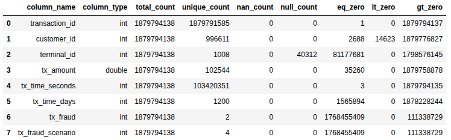

# Анализ качества и очистка датасета мошеннических финансовых операций

## Цель работы
Знакомство с основными проблемами, которые могут встречаться в данных:
  * определение их наличия в датасете
  * обработка и очистка набора данных
  * разработка скрипта очистки данных с использованием Apache Spark

## Задачи:
1. Создана инфраструктруа в **Yandex Cloud** с помощью **Terraform**
    * создан служебный аккаунт в **Yandex Cloud** для работы с кластером **Data Processing**
    * создан бакет в **Yandex Cloud Object Storage** 
      * предоставлено право на запись для системного аккаунта 
      * предоставлен публичный достпуп на чтение
      * точку доступа: **s3://mlops-bucket-fahzeeph/**
    * создан Spark-кластер в **Data Processing**
      * созданы подкластеры
        * master:
          * класс хоста: s3-c2-m8
          * кол-во хостов: 1
          * размер хранилища: 40 ГБ
        * data:
          * класс хоста: s3-c4-m16
          * кол-во хостов: 3
          * размер хранилища: 128 ГБ
      * в настройках указан созданный бакет
      * создан скрипт для удаления кластера: **destroy_spark.sh**
    * настроена сеть для корректного доступа к сервисам
    * создан **proxy-узел** (**Yandex Compute Instance**) для работы с кластером

2. Загружены все данные из учебного бакета в **HDFS**
    * создан скрипт для копирования данных: **copy2hdfs.sh**

3. при проведенном анализе качества обнаружено:
    

      
сводная информация по датасету

      

      более детальная информация в [dataset_analysis.ipynb](notbooks/dataset_analysis.ipynb)
    

    * пропуски в колонке *terminal_id*
    * отрицательные идентификаторы в колонке *customer_id*
    * нулевые значения в колонках *tx_amount* и *tx_time_seconds*
    * нулевые значения в колонках индентификторов *transaction_id* и *customer_id*
    * дубли в колонке *transaction_id*
    * колонки содержащие категориальные данные: 
      * *tx_fraud*: [0, 1]
      * *tx_fraud_scenario*: [0, 1, 2, 3]

4. на основе проведенного анализа качества создан [скрипт](infrastructure/scripts/dataset_cleanup.py) для очистки датасета и сохранении его в бакет в формате parquet, подходящем для хранения большого объема структурированных данных

5. в соответствии с достигнутыми результатами, изменить статус задачи на Kanban-доске в GitHub Projects

6. полностью удален созданный кластер, чтобы избежать оплаты ресурсов в период
его простаивания
