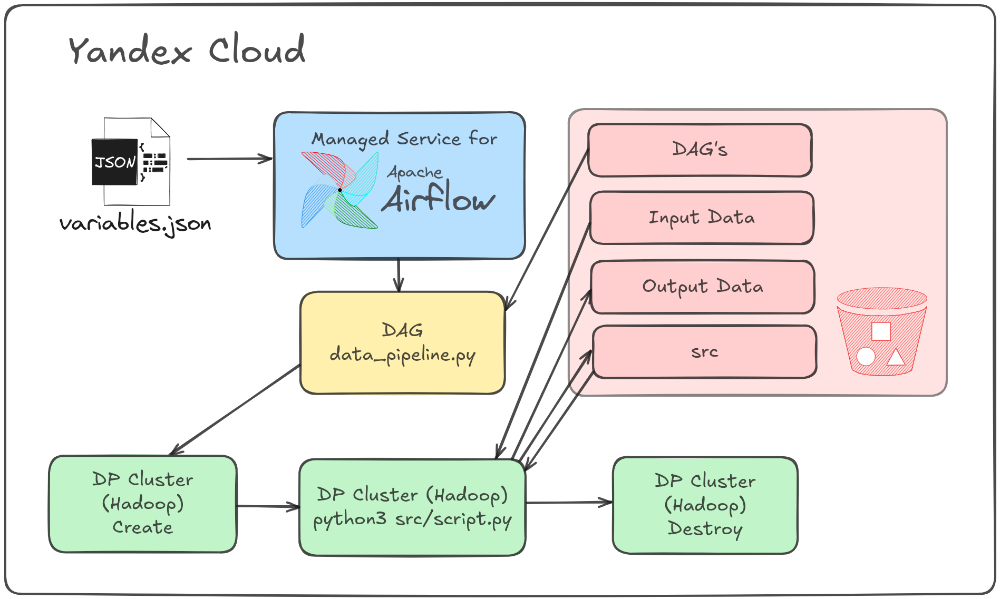
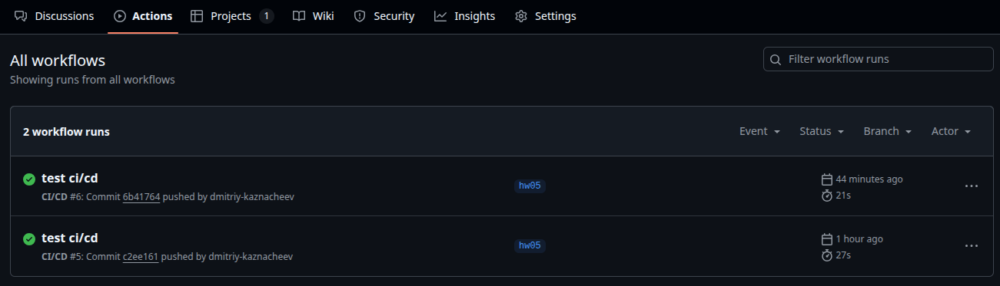
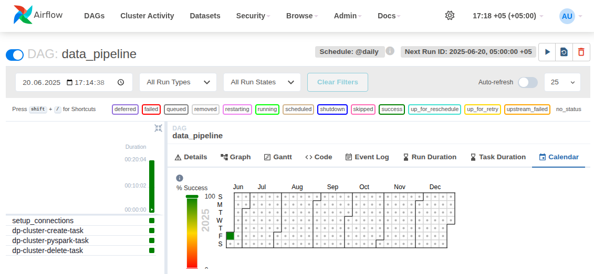

# Периодический запуск процедуры очистки датасета мошеннических финансовых транзакций


## Цель работы
Разработка собственных графов с помощью языка Python для Apache Airflow:
  * создание инфраструктуры с помощью инструмента Terraform
  * развертывание кластера Apache Airflow
  * организация периодического запуска процедуры очистки данных
  * знакомство с концепцией ориентированных направленных графов (DAGs) 
  * организация с помощью графов последовательность запуска задач по расписанию 


## Схема пайплайна обработки данных



## Задачи:
1. С помощью Terraform создана [инфраструктура](./infra) в Yandex.Cloud
    <details>
      <summary>команды для развертыавния</summary>

      ```
      $ make init -C infra
      $ make apply -C infra
      ```
    </details>

2. Запущена система Apache Airflow на отдельной виртуальной машине Yandex.Cloud \
  через веб-интерфейс Airflow импортированны переменные из файла **infra/variables.json** \
  (**Admin ⇨ Variables**)

3. Создан DAG (**dags/data_pipeline.py**):
    * настроено автоматизированное создание и удаления кластера Apache Spark 
    * настроен запуск скрипта очистки датасета **src/pyspark_script.py** 
    * в графе прописаны этапы копирования скрипта и необходимых ему файлов на Spark-кластер
    * настроен запуск графа на кластере посредством spark-submit
    
    <br />
    <details>
      <summary>команды для копирования скриптов на S3-бакет</summary>

      ```
      $ make upload_src
      $ make upload_dags
      $ make upload_data
      ```
      или одной командой
      ```
      $ make upload_all
      ```
    </details>

4. Граф автоматически загрузился в систему при коммите и отображается в графическом интерфейсе.
    <details>
      <summary>скриншот GitHub Actions</summary>

      
    </details>
5. Настроено ежедневное исполнение разработанного DAG в Apache AirFlow
    <details>
      <summary>скриншот Airflow</summary>

      
    </details>
6. В соответствии с достигнутыми результатами, изменен статус задач на Kanban-доске в GitHub Projects.
7. После выполнения созданный кластер полностью удалить, чтобы избежать оплаты ресурсов в период его простаивания.

